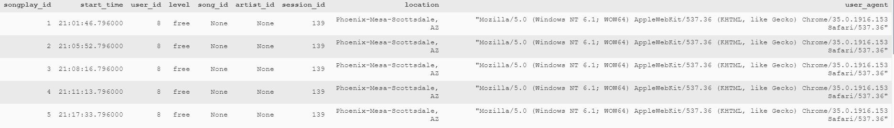
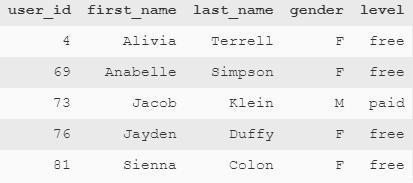
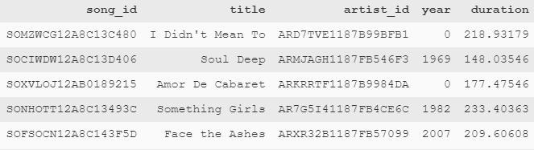
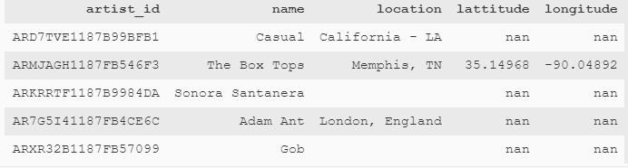
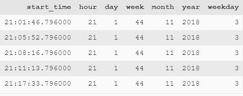

# Data Modeling with PostgreSQL

Python program that creates a Postgres database by defining fact and dimension tables for a star schema and write an ETL pipeline that transfers data from files in two local directories into tables in Postgres using Python and SQL. The database schema and ETL pipeline optimizes queries on song play analysis, with the intent to understand the songs the users of Sparkify are listening to.

## Required Libraries

1. psycopg2 [http://initd.org/psycopg/]
2. pandas [https://pandas.pydata.org/]
   
### Installation

1. Ensure that PostgreSQL is installed on the computer (https://www.postgresql.org/download/)
2. Set up PostgreSQL server by executing PgAdmin on the computer and follow instructions
3. `pip install psycopg2` to implement Python PostgreSQL
4. Install Pandas in python using `pip install pandas`
5. Change the value of `psycopg2.connect` in *create_tables.py* & *etl.py* to connect to your desired database

## Files

- data folder: Contains all data in JSON format
- sql_queries.py: Contains string SQL queries to be used to create database
- create_tables.py: Python program that creates the necessary database table
- etl.ipynb: Jupyter worksheet on extracting values from JSON files and add them into the database tables
- etl.py: Python program that adds values extracted from the JSON files, into the database tables
- test.ipynb: Jupyter program that displays samples of the tables within the created database.

## Running the tests

1. Run create_tables.py
2. Run etl.py
3. Run test.ipynb [To view samples of database]

# Database Overview

##  _songplays_ Table

| col_name    | data_type | allow_nulls | key     |
|-------------|-----------|-------------|---------|
| songplay_id | int       | N           | primary |
| start_time  | time      | N           | -       |
| user_id     | int       | N           | -       |
| level       | varchar   | N           | -       |
| session_id  | int       | N           | -       |
| location    | varchar   | N           | -       |
| user_agent  | varchar   | N           | -       |

### Example:

## _users_ Table

| col_name   | data_type | allow_nulls | key     |
|------------|-----------|-------------|---------|
| user_id    | int       | N           | primary |
| first_name | varchar   | N           | -       |
| last_name  | varchar   | N           | -       |
| gender     | char(1)   | Y           | -       |
| level      | varchar   | N           | -       |

### Example:

## _songs_ Table

| col_name  | data_type | allow_nulls | key     |
|-----------|-----------|-------------|---------|
| song_id   | varchar   | N           | primary |
| title     | varchar   | N           | -       |
| artist_id | varchar   | N           | -       |
| year      | int       | Y           | -       |
| duration  | float     | N           | -       |

### Example:

## _artists_ Table

| col_name  | data_type | allow_nulls | key     |
|-----------|-----------|-------------|---------|
| artist_id | varchar   | N           | primary |
| name      | varchar   | N           | -       |
| location  | varchar   | Y           | -       |
| lattitude | int       | Y           | -       |
| longitude | float     | Y           | -       |

### Example:

## _time_ Table

| col_name  | data_type | allow_nulls | key     |
|-----------|-----------|-------------|---------|
| artist_id | varchar   | N           | primary |
| name      | varchar   | N           | -       |
| location  | varchar   | Y           | -       |
| lattitude | int       | Y           | -       |
| longitude | float     | Y           | -       |

### Example:

# Project Overview

## Built With

* [PostgreSQL](https://www.postgresql.org/) - The database used
* [Python](https://www.python.org/) - Programming language

## Authors

* **Jobelle Lee** - [themaxermister](https://github.com/themaxermister)# Data-Engineering-at-Udacity
